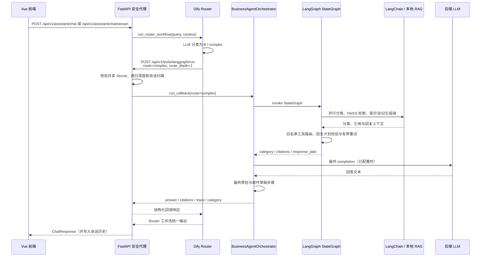

# 东软智慧商务 AI 助手平台

[](https://github.com/dzc-bit/A-platform/actions/workflows/ci.yml)
[](LICENSE)

面向企业客户、客服人员、系统管理员和决策者的全栈 AI 助手平台，提供智能对话、知识库检索、客服工单、运营看板与 AI 配置管理，主线为 **Vue 3 + FastAPI**。

它最大的特点是**默认零密钥、完全离线可运行**：没有云端 API Key 也能跑通"混合 RAG + LangGraph 多智能体编排 + 流式响应"的完整链路，并返回真实检索引用与 Agent 轨迹；配置 OpenAI-compatible 服务或 Dify 后，同一套代码按环境变量平滑增强，业务逻辑无需改动。这让整个系统的行为完全可复现，也便于离线环境演示与测试。

## 功能特性

- **智能助手**：SSE 逐 Token 流式输出；回答附带检索引用、Agent 执行轨迹与 `used_fallback` 状态，AI 决策过程可解释
- **混合 RAG**：确定性本地 Embedding，FAISS 与稀疏关键词加权 RRF 融合检索，可离线验证检索质量
- **多智能体编排**：LangGraph `StateGraph` 组织任务规划、分类/检索并行、白名单工具路由、回复计划质检与有界重试（最多一次，无循环风险）
- **Dify 混合路由**：Router 工作流对请求做 A（简单知识）/ B（复杂任务）/ C（媒体生成）意图分类，按类别选择执行位置；Dify 未配置、超时或失败时自动降级到本地 Orchestrator
- **媒体与语音**：TTS 朗读与文生图经 Dify 子工作流返回真实 artifacts；浏览器语音输入与朗读基于 Web Speech API，不支持时自动回退完整文本流程
- **客服工单**：受保护 SSE 实时更新；白名单只读工具仅返回工单队列聚合，不暴露客户记录
- **运营看板**：近 7 日咨询与 AI 质检趋势按消息、工单时间戳聚合；无历史数据时明确显示"暂无历史对比"，不虚构对比
- **管理与审计**：用户、知识库、AI 配置与审计日志；合同、付款、订单、故障等高风险问题不臆造业务事实，信息不足时提示补充并转人工核验
- **回答缓存**：按用户、会话、知识/工单版本、模型设置与偏好隔离；缓存命中使用明确的 `origin=cache` 标记，不会切片冒充模型 Token

## 技术栈

| 层 | 技术 |
| --- | --- |
| 前端 | Vue 3 + Vite + TypeScript + Pinia + Vue Router |
| 后端 | FastAPI + SQLite + LangChain（RAG / LCEL）+ LangGraph（StateGraph） |
| AI | 本地混合 RAG（FAISS + 稀疏关键词 RRF）、OpenAI-compatible 适配器、Dify 工作流增强 |
| 部署 | Docker Compose / Kubernetes（Kustomize 清单）、GitHub Actions CI/CD |

## 架构

前端始终只访问 FastAPI；FastAPI 统一负责认证、会话持久化、密钥隔离、结果归一化与失败降级，Dify API Key 不下发到浏览器。三层 AI 组件各司其职：

| 组件 | 职责 |
| --- | --- |
| Dify | 可视化工作流与外部能力平台：Router 对请求做 A/B/C 意图分类，A 类直接执行知识检索与回答生成，B/C 类经 HTTP 节点回调 FastAPI；另承载 TTS、文生图子工作流 |
| LangChain | 后端 AI 组件层：`Document`、文本切分、Embedding/FAISS、提示词与会话记忆，LCEL `RunnableParallel`/`RunnableBranch` 组织证据与谨慎分支 |
| LangGraph | 后端复杂任务状态编排层：任务规划、并行分类/检索、白名单工具路由、回复计划质检与有界重试 |

### 请求路由

| 路由 | 典型请求 | 执行位置 |
| --- | --- | --- |
| A：简单知识 | 企业制度、FAQ、稳定产品说明 | Dify Router 分类后直接执行知识库检索与回答生成；FastAPI 只归一化并持久化结果 |
| B：复杂任务 | 多步推理、工单统计、数据库聚合、订单/合同/付款等需工具或人工复核的任务 | LangGraph 编排复杂任务；LangChain/FAISS 提供本地检索与提示词组件；白名单工具只返回获准的数据或聚合 |
| C：媒体生成 | 朗读上一条回复、把这段话转成语音、生成一张图片 | Dify Router 分类为 `tts` 或 `image`，由对应 Dify 媒体子工作流返回 `artifacts` |
| Router 降级 | Dify 未配置、超时、失败或空输出 | FastAPI 直接运行本地 `BusinessAgentOrchestrator`，由 LangGraph + LangChain/RAG 完成回答；图不可用时退到顺序编排 |

Dify 分类 JSON 无法解析或类别不合法时安全降级到 B 类，避免把需要工具或人工复核的问题误送到简单知识分支。这里的 A/B/C 是 Dify 的外层路由；LangGraph 内部还会细分"工单统计""系统故障""合同咨询""一般咨询"等业务类别，两组分类不可混用。

回调接口 `POST /api/v1/tools/langgraph/run` 是 Dify HTTP 节点专用的内部接口：要求 `X-Dify-Callback-Secret`，拒绝 `route_depth > 1`，并校验 `conversation_id` 与 `user_id` 的归属。复杂任务回调只运行后端 Orchestrator、不会再次调用 Router，因此不存在 `FastAPI → Dify Router → FastAPI → Dify Router` 的递归；C 类媒体路径调用 TTS/文生图子工作流后也不会再进入 Router。

### B 类复杂任务完整调用链



LangGraph 内部的主要节点顺序为：`task_planner` → `classification_agent` 与 `knowledge_query_agent` 并行 → `parallel_join` → 按分类选择 `business_tool_agent` → `response_agent` → `response_plan_quality` → `finish`。回复计划质检失败最多重试一次。最终模型 completion、最终回答质检和邮件草稿步骤在同步 `StateGraph` 完成后执行。

最终回答缓存命中时会直接返回缓存并跳过 Dify Router 与 LangGraph。Router 启用时，前端仍调用 SSE 接口，但后端会等待 Dify blocking 工作流完成再发送 `trace`、`reset` 和 `done`；只有本地 Orchestrator 路径支持模型 Token 的逐段流式输出。

## 快速启动

### Docker Compose

```powershell
Copy-Item .env.example .env
docker compose up --build
```

上面的命令启动前端、后端与 Redis。若要把仓库内 `dify/` 的官方 Dify 环境也纳入同一次演示，先准备官方环境文件，再由隔离编排脚本启动两个 Compose 项目：

```powershell
Copy-Item dify\docker\.env.example dify\docker\.env
powershell -NoProfile -ExecutionPolicy Bypass -File scripts\stack.ps1 -Action config -WithDify
powershell -NoProfile -ExecutionPolicy Bypass -File scripts\stack.ps1 -Action up -WithDify
```

`stack.ps1` 使用独立项目名，不会覆盖已有 Redis 和数据卷；脚本只负责容器编排，不代替 Dify 界面配置。首次启动后需在 `http://localhost:8081/install` 完成 Dify 初始化，并把已发布应用 Key 放入根 `.env`。若 Dify 已由其他目录/项目运行，请先设置 `DIFY_COMPOSE_DIR` 与 `DIFY_COMPOSE_PROJECT_NAME` 指向同一官方 checkout，再执行 `config/ps/health/smoke`，避免误启动第二套 Dify。

启动后访问：

| 服务 | 地址 |
| --- | --- |
| 前端 | http://localhost:5173 |
| 后端 API 文档 | http://localhost:8000/docs |
| 健康检查 | http://localhost:8000/api/v1/health |

Compose 默认只将前后端端口绑定到本机回环地址。容器数据库固定使用命名卷中的 `/app/data/business_ai.db`；原生启动后端时则默认使用 `backend/data/business_ai.db`，两种路径互不混用。

### 演示账号

首次启动会自动写入 SQLite 演示数据。先在根目录 `.env` 中设置 `DEMO_PASSWORD`，再使用以下账号登录（密码统一为 `DEMO_PASSWORD`）：

| 角色 | 账号 | 功能入口 |
| --- | --- | --- |
| 企业用户 | `enterprise@neusoft.local` | 智能助手、知识库问答 |
| 客服人员 | `support@neusoft.local` | 客服工作台、工单处理 |
| 管理员 | `admin@neusoft.local` | 用户、知识库、AI 配置与审计 |
| 决策者 | `executive@neusoft.local` | 运营看板与分析报告 |

### 本地开发

```powershell
Copy-Item .env.example .env
Set-Location backend
python -m venv .venv
.\.venv\Scripts\Activate.ps1
pip install -r requirements.txt
uvicorn app.main:app --reload --port 8000
```

新开一个终端：

```powershell
Set-Location frontend
corepack enable
pnpm install --frozen-lockfile
pnpm dev
```

前端开发服务器通过 Vite 代理将 `/api` 转发至 `http://localhost:8000`。生产静态站点由 Nginx 将同一路径代理给后端。

常用命令已封装在 `Makefile` 中，例如 `make up` / `make health` / `make backend-test` / `make frontend-build`，以及 Dify 隔离编排的 `make stack-up` / `make stack-smoke` 等。

## AI 运行模式

AI 能力按环境变量分三档渐进，从零配置的完全离线到 Dify 全量增强，切换不需要改动业务代码。

### 第 1 档：离线运行（默认，零密钥）

系统使用 LangChain `Document`、`RecursiveCharacterTextSplitter`、确定性本地 Embedding、FAISS 与稀疏关键词加权 RRF 完成可离线验证的混合 RAG。LCEL 使用 `RunnableParallel`/`RunnableBranch` 组织证据与谨慎分支，并组合最近窗口和有界摘要记忆；LangGraph `StateGraph` 执行受控任务分解、分类/检索并行、条件工具路由和有界重试。真实只读 SQLite 工具只返回工单队列聚合，不暴露客户记录。

### 第 2 档：OpenAI-compatible 模型

设置 `LLM_API_KEY`、`LLM_BASE_URL`、`LLM_MODEL` 后，适配器会使用 `stream=true` 消费提供方 SSE delta，并将模型 Token 即时转发给前端；客户端取消会关闭上游流，异常会在首 Token 前回退或在部分 Token 后以 `reset` 修正。

### 第 3 档：Dify 工作流增强

设置 `DIFY_API_URL` 和 `DIFY_ROUTER_API_KEY` 后，主对话入口优先调用已发布的 Dify Router 工作流。Dify 未配置、超时、返回空结果或执行失败时，FastAPI 会在同一数据库会话中执行本地 LangGraph/RAG Agent，并返回真实 `citations` 与 `trace`，而不是固定的泛化文案。

`dify/` 中提供 Router、扩展客服、TTS 和文生图四个工作流 DSL 模板；`scripts/stack.ps1` 只负责容器编排，不代替 Dify 界面配置。

密钥只写入本机 `.env`，不要提交到仓库。详细方案见 `dify/README.md`。

### 模型与凭据区分

| 配置位置 | 用途 |
| --- | --- |
| Dify 控制台的模型提供方 | 供 Router 意图分类和 A 类知识回答节点使用；凭据由 Dify 保存 |
| `LLM_API_KEY` / `LLM_BASE_URL` / `LLM_MODEL` | 供 FastAPI 内的 OpenAI-compatible 客户端生成 B 类复杂任务或本地降级回答；未配置时使用确定性的本地回退 |
| `DIFY_ROUTER_API_KEY` | FastAPI 调用已发布 Router 工作流的应用 Key；与普通客服、TTS、文生图应用 Key 分离 |
| `DIFY_CALLBACK_SECRET` | Dify HTTP 节点回调 FastAPI 时使用的共享密钥；两侧值必须一致 |
| `DIFY_ROUTER_TIMEOUT_SECONDS` | FastAPI 等待 Router 及其回调完成的总超时，默认 150 秒 |

`DIFY_API_KEY` 仍用于独立客服工作流，并作为 TTS/文生图未配置专用 Key 时的兼容回退，但它不替代 `DIFY_ROUTER_API_KEY`。媒体应用可分别配置 `DIFY_TTS_API_KEY` 和 `DIFY_IMAGE_API_KEY`。

## 测试与质量

- **测试套件**：`backend/tests` 下 20 个 pytest 测试模块，覆盖 API 契约、流式响应、RAG 检索、Dify 路由回调、工单状态契约、实时交接、部署配置等
- **CI（GitHub Actions）**：后端编译检查与确定性 Agent/RAG 评测指标、前端类型检查与构建、Kustomize 清单渲染、Compose 全栈构建与健康冒烟测试
- **评测数据集**：`backend/evaluations` 提供 Agent 与 RAG 评测数据，`python scripts/evaluate_agent.py` 输出可复现的确定性指标
- **可解释性**：所有回答返回检索引用、Agent 轨迹与 `used_fallback` 状态，便于解释 AI 决策过程

## 仓库结构

```text
.
├── README.md                     # 项目总览（本文件）
├── LICENSE                       # MIT 许可证
├── .env.example                  # 运行配置模板（复制为 .env 后填写，不提交）
├── compose.yaml                  # 前端、后端与 Redis 编排
├── Makefile                      # 常用命令（up/test/build/stack-* 等）
│
├── backend/                      # FastAPI 后端（应用源码与测试）
│   ├── app/
│   │   ├── api.py                # 路由与接口实现（API 主文件）
│   │   ├── main.py               # 应用入口
│   │   ├── models.py             # 数据库模型
│   │   ├── schemas.py            # Pydantic 数据契约
│   │   ├── config.py             # 配置加载
│   │   ├── database.py           # 数据库会话
│   │   ├── dependencies.py       # 依赖注入
│   │   ├── security.py           # 认证与密钥
│   │   └── services/             # 业务服务：agent / rag / dify / llm / cache / vision / 审计 ...
│   ├── tests/                    # pytest 测试套件
│   ├── evaluations/              # AI 评测脚本与数据集
│   ├── scripts/                  # 后端辅助脚本（如 evaluate_agent.py）
│   ├── requirements.txt          # 运行依赖
│   ├── requirements-ai.txt       # AI 相关依赖
│   └── Dockerfile
│
├── frontend/                     # Vue 3 + Vite 单页应用
│   ├── src/
│   │   ├── api/                  # 后端接口封装（client.ts）
│   │   ├── components/           # 通用组件（对话气泡 / 看板卡片 / 实时面板 ...）
│   │   ├── views/                # 页面视图（对话 / 知识库 / 工单 / 看板 / 管理 ...）
│   │   ├── stores/               # Pinia 状态（auth 等）
│   │   ├── composables/          # 组合式函数（如语音 useSpeech）
│   │   └── router/               # 路由
│   ├── vite.config.ts            # Vite 配置（含 /api 代理）
│   ├── nginx.conf                # 生产静态站点代理
│   └── Dockerfile
│
├── dify/                         # Dify 工作流样例与接入说明
│   ├── router-workflow.yml       # A/B/C 智能路由工作流
│   ├── business-support-workflow.yml  # 扩展客服工作流
│   ├── text-to-speech-workflow.yml    # TTS 工作流
│   ├── text-to-image-workflow.yml     # 文生图工作流
│   ├── README.md                 # Dify 接入说明
│   ├── day8-preflight.md         # Dify 接入预检要点
│   └── knowledge/                # 知识库样例
│
├── deploy/
│   └── k8s/                      # Kubernetes 部署清单（backend / frontend / redis / ingress ...）
│
├── scripts/
│   └── stack.ps1                 # 本平台 + 官方 Dify 的隔离一键编排
│
└── .github/
    └── workflows/                # CI（ci.yml）、镜像发布（release.yml）
```

> 说明：应用运行只需 `backend/`、`frontend/`、`dify/`、`deploy/`、`scripts/`、`compose.yaml` 与 `.env`。`.env`、`.venv`、`node_modules`、`dist`、`.pytest_cache` 等为本地产物，已被 `.gitignore` 忽略。

## 文档索引

| 文档 | 用途 |
| --- | --- |
| [README.md](README.md) | 项目总览、启动方式、架构与配置 |
| [dify/README.md](dify/README.md) | Dify 工作流接入与环境准备说明 |
| [dify/day8-preflight.md](dify/day8-preflight.md) | Dify 接入预检要点 |

## Roadmap

- 事件 Broker 接入 Redis Pub/Sub，支持多实例部署下的实时工单推送
- 基于 Dify 会话变量的多轮澄清追问回路（当前 `need_clarification` 固定为 `false`）
- Dify Router 路径下的逐段流式输出（当前仅本地 Orchestrator 路径支持 Token 级流式）
- 生产化增强：托管数据库、受控对象存储、密钥管理、审计与监控服务接入

## License

本项目基于 [MIT License](LICENSE) 开源。
